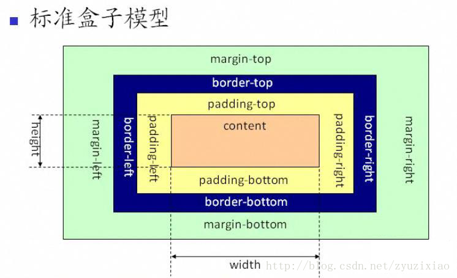
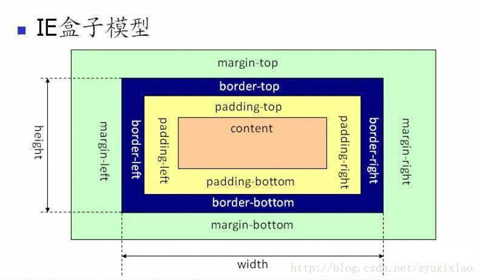

# CSS

## 盒子模型

参考文档：http://www.cnblogs.com/cchyao/archive/2010/07/12/1775846.html



从上图可以看到标准 **W3C 盒子模型的范围包括 margin、border、padding、content，并且 content 部分不包含其他部分。**



　从上图可以看到 IE 盒子模型的范围也包括 margin、border、padding、content，和标准 W3C 盒子模型不同的是：IE 盒子模型的 content 部分包含了 border 和 pading。

网页中的盒子模型；我们常常要控制盒子模型的宽度width:   

w3c中的盒子模型的宽:包括margin+border+padding+width;

    width:margin*2+border*2+padding*2+width;

    height:margin*2+border*2+padding*2+height;

iE中的盒子模型的width:也包括margin+border+padding+width;

上面的两个宽度相加的属性是一样的。不过在ie中content的宽度包括padding和border这两个属性；

例如一个盒子模型如下：margin:20px,border:10px,padding:10px;width:200px;height:50px;

如果用w3c盒子模型解释，

​	那么这个盒子模型占用的

 		宽度为：20*2+10*2+10*2+200=280px; 

  		高度：20*2+10*2+20*2+50=130px;

 		盒子的实际宽度大小为:10*2+10*2+200=240px;

​	 	实际高度：10*2+10*2+50=90px;

用ie的盒子模型解释 ：

​	盒子在网页中占据的大小

​		宽度为20*2+200=240px; 

​		高度为：202+50=90px;

​		盒子的实际大小为：宽度:200px, 

​		高度:50px;

那应该选择哪中盒子模型呢？当然是“标准 w3c 盒子模型”了。怎么样才算是选择了“标准 w3c 盒子模型”呢？很简单，就是在网页的顶部加上 doctype 声明。假如不加 doctype 声明，那么各个浏览器会根据自己的行为去理解网页，即 ie 浏览器会采用 ie 盒子模型去解释你的盒子，而 ff 会采用标准 w3c 盒子模型解释你的盒子，所以网页在不同的浏览器中就显示的不一样了。反之，假如加上了 doctype 声明，那么所有浏览器都会采用标准 w3c 盒子模型去解释你的盒子，网页就能在各个浏览器中显示一致了。

## 优先级

参考文档：http://www.cnblogs.com/xugang/archive/2010/09/24/1833760.html

（外部样式）External style sheet <（内部样式）Internal style sheet <（内联样式）Inline style

如果外部样式放在内部样式的后面，则外部样式将覆盖内部样式。

**CSS ****优先级法则：**

A  选择器都有一个权值，权值越大越优先；

B  当权值相等时，后出现的样式表设置要优于先出现的样式表设置；

C  创作者的规则高于浏览者：即网页编写者设置的CSS 样式的优先权高于浏览器所设置的样式；

D  继承的CSS 样式不如后来指定的CSS 样式；

E  在同一组属性设置中标有“!important”规则的优先级最大

## 选择器

child子节点中查找，type同类型子节点当中查找

:only-child：只有一个

:only-of-type：只有一种，在所有兄弟节点当中，只有这一个这种类型的

```
<b>XXX</b>
<p>XXX</p>
<b>xxxx</b>
only-of-type匹配p
```

first、last、only、nth、nth-last