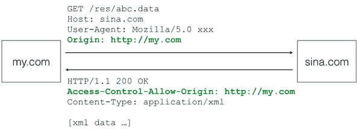
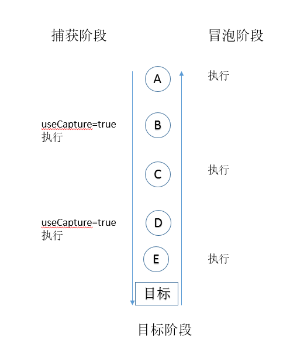

# 浏览器

## Dom操作

### 创建DOM

```javascript
var haskell = document.createElement('p');
haskell.id = 'haskell';
haskell.innerText = 'Haskell';

var d = document.createElement('style');
d.setAttribute('type', 'text/css');
d.innerHTML = 'p { color: red }';
```

### 更新DOM

#### 修改内容

1.innerHTML：如果写入的字符串是通过网络拿到了，要注意对字符编码来避免XSS攻击。

2.innerText或textContent属性，这样可以自动对字符串进行HTML编码，保证无法设置任何HTML标签：

两者的区别在于读取属性时，`innerText`不返回隐藏元素的文本，而`textContent`返回所有文本。另外注意IE<9不支持`textContent`。

Q：以下测试之后并没有转为编码，而是直接作为普通文本插入到节点里面

```html
p.innerText = '<script>alert("Hi")</script>';
// HTML被自动编码，无法设置一个<script>节点:
// <p id="p-id">&lt;script&gt;alert("Hi")&lt;/script&gt;</p>
```
#### 修改css：

DOM节点的`style`属性对应所有的CSS，可以直接获取或设置。因为CSS允许`font-size`这样的名称，但它并非JavaScript有效的属性名，所以需要在JavaScript中改写为驼峰式命名`fontSize`

```html
p.style.color = '#ff0000';
p.style.fontSize = '20px';
p.style.paddingTop = '2em';
```

### 插入DOM

appendChild：把一个子节点添加到父节点的最后一个子节点。

​	因为我们插入的`js`节点已经存在于当前的文档树，因此这个节点首先会从原先的位置删除，再插入到新的位置。

insertBefore：parentElement.insertBefore(newElement, referenceElement);

### 删除DOM

removeChild

删除后的节点虽然不在文档树中了，但其实它还在内存中，可以随时再次被添加到别的位置。

Act：children属性是一个只读属性，并且它在子节点变化时会实时更新。

​	单线程执行模式：在JavaScript中，浏览器的JavaScript执行引擎在执行JavaScript代码时，总是以单线程模式执行，也就是说，任何时候，JavaScript代码都不可能同时有多于1个线程在执行。在JavaScript中，执行多任务实际上都是异步调用

## 文件

```javascript
var
    fileInput = document.getElementById('test-image-file'),
    info = document.getElementById('test-file-info'),
    preview = document.getElementById('test-image-preview');
// 监听change事件:
fileInput.addEventListener('change', function () {
    // 清除背景图片:
    preview.style.backgroundImage = '';
    // 检查文件是否选择:
    if (!fileInput.value) {
        info.innerHTML = '没有选择文件';
        return;
    }
    // 获取File引用:
    var file = fileInput.files[0];
    // 获取File信息:
    info.innerHTML = '文件: ' + file.name + '<br>' +
                     '大小: ' + file.size + '<br>' +
                     '修改: ' + file.lastModifiedDate;
    if (file.type !== 'image/jpeg' && file.type !== 'image/png' && file.type !== 'image/gif') {
        alert('不是有效的图片文件!');
        return;
    }
    // 读取文件:
    var reader = new FileReader();
    reader.onload = function(e) {
        var
            data = e.target.result; // 'data:image/jpeg;base64,/9j/4AAQSk...(base64编码)...'            
        preview.style.backgroundImage = 'url(' + data + ')';
    };
    // 以DataURL的形式读取文件:
  	//发起一个异步操作来读取文件内容。因为是异步操作，所以我们在JavaScript代码中就不知道什么时候操作结束，因此需要先设置一个回调函数
    reader.readAsDataURL(file);
});
```

## AJAX

### 请求方法

```javascript
var request;
if (window.XMLHttpRequest) {
    request = new XMLHttpRequest();
} else {
    request = new ActiveXObject('Microsoft.XMLHTTP');
}
request.onreadystatechange = function () { // 状态发生变化时，函数被回调
    if (request.readyState === 4) { // 成功完成
        // 判断响应结果:
        if (request.status === 200) {
            // 成功，通过responseText拿到响应的文本:
            return success(request.responseText);
        } else {
            // 失败，根据响应码判断失败原因:
            return fail(request.status);
        }
    } else {
        // HTTP请求还在继续...
    }
}

// 发送请求:
request.open('GET', '/api/categories');
request.send();
```

​	XMLHttpRequest对象的open()方法有3个参数，第一个参数指定是GET还是POST，第二个参数指定URL地址，第三个参数指定是否使用异步，默认是true，所以不用写。

​	注意，千万不要把第三个参数指定为false，否则浏览器将停止响应，直到AJAX请求完成。如果这个请求耗时10秒，那么10秒内你会发现浏览器处于“假死”状态。

​	最后调用send()方法才真正发送请求。GET请求不需要参数，POST请求需要把body部分以字符串或者FormData对象传进去。

### 安全机制

参考文档：http://www.liaoxuefeng.com/wiki/001434446689867b27157e896e74d51a89c25cc8b43bdb3000/001434499861493e7c35be5e0864769a2c06afb4754acc6000

​	浏览器的同源策略导致的。默认情况下，JavaScript在发送AJAX请求时，URL的域名必须和当前页面完全一致。

​	完全一致的意思是，域名要相同（www.example.com和example.com不同），协议要相同（http和https不同），端口号要相同（默认是:80端口，它和:8080就不同）。有的浏览器口子松一点，允许端口不同，大多数浏览器都会严格遵守这个限制。

### 请求外域解决方法：

#### Flash插件

一是通过Flash插件发送HTTP请求，这种方式可以绕过浏览器的安全限制，但必须安装Flash，并且跟Flash交互。不过Flash用起来麻烦，而且现在用得也越来越少了。

#### 代理服务器

二是通过在同源域名下架设一个代理服务器来转发，JavaScript负责把请求发送到代理服务器：

```
'/proxy?url=http://www.sina.com.cn'

```

代理服务器再把结果返回，这样就遵守了浏览器的同源策略。这种方式麻烦之处在于需要服务器端额外做开发。

#### JSONP

公式插件就用的这个

第三种方式称为JSONP，它有个限制，只能用GET请求，并且要求返回JavaScript。这种方式跨域实际上是利用了<u>浏览器允许跨域引用JavaScript资源：</u>

```
<html>
<head>
    <script src="http://example.com/abc.js"></script>
    ...
</head>
<body>
...
</body>
</html>

```

JSONP通常以函数调用的形式返回，例如，返回JavaScript内容如下：

```
foo('data');
```

这样一来，我们如果在页面中先准备好`foo()`函数，然后给页面动态加一个``节点，相当于动态读取外域的JavaScript资源，最后就等着接收回调了。

以163的股票查询URL为例，对于URL：[http://api.money.126.net/data/feed/0000001,1399001?callback=refreshPrice](http://api.money.126.net/data/feed/0000001,1399001?callback=refreshPrice)，你将得到如下返回：

```
refreshPrice({"0000001":{"code": "0000001", ... });

```

因此我们需要首先在页面中准备好回调函数：

```
function refreshPrice(data) {
    var p = document.getElementById('test-jsonp');
    p.innerHTML = '当前价格：' +
        data['0000001'].name +': ' + 
        data['0000001'].price + '；' +
        data['1399001'].name + ': ' +
        data['1399001'].price;
}
```

当前价格：

刷新

最后用`getPrice()`函数触发：

```
function getPrice() {
    var
        js = document.createElement('script'),
        head = document.getElementsByTagName('head')[0];
    js.src = 'http://api.money.126.net/data/feed/0000001,1399001?callback=refreshPrice';
    head.appendChild(js);
}

```

就完成了跨域加载数据。

#### CORS

所有操作都是要经过浏览器控制处理

​	本域——浏览器——服务器


如果浏览器支持HTML5，那么就可以一劳永逸地使用新的跨域策略：CORS了。

CORS全称Cross-Origin Resource Sharing，是HTML5规范定义的如何跨域访问资源。

了解CORS前，我们先搞明白概念：

```xml
	Origin表示本域，也就是浏览器当前页面的域。当JavaScript向外域（如sina.com）发起请求后，浏览器收到响应后，首先检查Access-Control-Allow-Origin是否包含本域，如果是，则此次跨域请求成功，如果不是，则请求失败，JavaScript将无法获取到响应的任何数据。
```



​	假设本域是`my.com`，外域是`sina.com`，只要响应头`Access-Control-Allow-Origin`为`http://my.com`，或者是`*`，本次请求就可以成功。

​	跨域能否成功，取决于对方服务器是否愿意给你设置一个正确的`Access-Control-Allow-Origin`，决定权始终在对方手中。

​	Type A：

上面这种跨域请求，称之为“简单请求”。简单请求包括GET、HEAD和POST（POST的Content-Type类型仅限`application/x-www-form-urlencoded`、`multipart/form-data`和`text/plain`），并且不能出现任何自定义头（例如，`X-Custom: 12345`），通常能满足90%的需求。

​	Type B：

无论你是否需要用JavaScript通过CORS跨域请求资源，你都要了解CORS的原理。最新的浏览器全面支持HTML5。在引用外域资源时，除了JavaScript和CSS外，都要验证CORS。例如，当你引用了某个第三方CDN上的字体文件时：

```
/* CSS */
@font-face {
  font-family: 'FontAwesome';
  src: url('http://cdn.com/fonts/fontawesome.ttf') format('truetype');
}
```

如果该CDN服务商未正确设置`Access-Control-Allow-Origin`，那么浏览器无法加载字体资源。

​	Type C：

对于PUT、DELETE以及其他类型如`application/json`的POST请求，在发送AJAX请求之前，浏览器会先发送一个`OPTIONS`请求（称为preflighted请求）到这个URL上，询问目标服务器是否接受：

```
OPTIONS /path/to/resource HTTP/1.1
Host: bar.com
Origin: http://my.com
Access-Control-Request-Method: POST
```

服务器必须响应并明确指出允许的Method：

```
HTTP/1.1 200 OK
Access-Control-Allow-Origin: http://my.com
Access-Control-Allow-Methods: POST, GET, PUT, OPTIONS
Access-Control-Max-Age: 86400
```

浏览器确认服务器响应的`Access-Control-Allow-Methods`头确实包含将要发送的AJAX请求的Method，才会继续发送AJAX，否则，抛出一个错误。

由于以`POST`、`PUT`方式传送JSON格式的数据在REST中很常见，所以要跨域正确处理`POST`和`PUT`请求，服务器端必须正确响应`OPTIONS`请求。

需要深入了解CORS的童鞋请移步[W3C文档](http://www.w3.org/TR/cors/)。

## Promise

参考文档：http://www.liaoxuefeng.com/wiki/001434446689867b27157e896e74d51a89c25cc8b43bdb3000/0014345008539155e93fc16046d4bb7854943814c4f9dc2000

```javascript
Promise两个参数：第一个是成功，第二个是失败
new Promise(function (resolve, reject) {
    log('start new Promise...');
    var timeOut = Math.random() * 2;
    log('set timeout to: ' + timeOut + ' seconds.');
    setTimeout(function () {
        if (timeOut < 1) {
            log('call resolve()...');
            resolve('200 OK');
        }
        else {
            log('call reject()...');
            reject('timeout in ' + timeOut + ' seconds.');
        }
    }, timeOut * 1000);
}).then(function (r) {//成功处理
    log('Done: ' + r);
}).catch(function (reason) {//失败处理
    log('Failed: ' + reason);
});

```
## jQuery

### 自定义插件

编写一个jQuery插件的原则：

1. 给`$.fn`绑定函数，实现插件的代码逻辑；
2. 插件函数最后要`return this;`以支持链式调用；
3. 插件函数要有默认值，绑定在`$.fn..defaults`上；
4. 用户在调用时可传入设定值以便覆盖默认值。

```javascript
$.fn.highlight = function (options) {
    // 合并默认值和用户设定值:
    var opts = $.extend({}, $.fn.highlight.defaults, options);
    this.css('backgroundColor', opts.backgroundColor).css('color', opts.color);
    return this;
}

// 设定默认值:
$.fn.highlight.defaults = {
    color: '#d85030',
    backgroundColor: '#fff8de'
}
```
# 事件

## 事件绑定

方法一：是直接在代码上加载事件

```javascript
<tr onmouseover='this.style.backgroundColor="red"' onmouseout='this.style.backgroundColor=""'><td>text1</td><td>text2</td></tr>
```

方法二：使用DOM的方式获取对象，并加载事件

```javascript
doms = document.getElementsByTagName('tr');
doms[0].onmouseover = function()
    {
        this.style.backgroundColor = "red";
    }
```

方法三：使用标准的addEventListener方式和IE私有的attachEvent方式，因为IE的attachEvent方式在参数传递时的缺陷

```javascript
 	//第一种：所有浏览器支持  
    oBig.onclick = function(){  
        console.log('Big Div');  
    }  
    //第二种：ie8及ie8以下不支持  
    oBig.addEventListener('click', function(){  
        console.log('Big Div');  
    }, true);  
  
    //第三种：ie6~ie10支持  
    oBig.attachEvent('onclick', function(){  
        console.log('Big Div');  
    });  
```

```javascript
element.addEventListener(type, listener[, useCapture]); // IE6~8不支持
```

​	参考文档：http://www.codeceo.com/article/javascript-event-catch-bubble.html

​	useCapture：是否使用捕获，如果值为true， useCapture 表示用户希望发起捕获。 在发起捕获之后， <u>只要Dom子树下发生了该事件类型，都会先被该事件监听器捕获，然后再被派发到Dom子树中的事件监听器中。并且向上冒泡的事件不会触发那些发起捕获的事件监听器。</u>进一步的解释可以查看 DOM Level 3 Events 文档。 useCapture 默认值为false 。



```html
<style>
.container{
  height: 500px;
  width: 500px;
  border: 1px solid red;
}
.inner_txt{
  height: 300px;
  width: 300px;
  border: 1px solid green;
}
.flowctn{
  height: 100px;
  width: 100px;
  border: 1px solid blue;
}
</style>

<div class="container">
  <div class="inner_txt">
    <div class="flowctn">
    </div>
  </div>
</div>

<script>
function fnA(){
  console.log("A");
}
function fnB(){
  console.log("B");
}
function fnC(){
  console.log("C");
}

$(function(){
  var ctn = $(".container")[0];
  var txt = $(".inner_txt")[0];
  var flowctn = $(".flowctn")[0];
  ctn.addEventListener("click", fnA, true);
  txt.addEventListener("click", fnB);
  flowctn.addEventListener("click", fnC);
});
</script>
	自己总结：设置了捕获的监听器优先级最高，由外向内设置了监听器捕获，则先按照由外向内顺序执行设置了捕获的监听器，再由触发节点由内向外执行，不再执行已经设置过捕获的监听器。如以上：
	在flowctn当中点击，因为A设置了事件捕获，所以优先被执行，之后再回到flowctn，再向上冒泡，执行inner_txt，因为container设置了捕获已经被执行，不再被执行。输出ACB
```

`addEventListener`是W3C工作组在DOM Level 2开始引入的一个注册事件监听器的方法；而在此之前，传统的事件监听方法是通过`element[’on’ + type]`的方式来注册的。它们两之间的主要区别是，`element[’on’ + type]`的方式无法使用事件捕获，并且`element[’on’ + type]`不支持对同一个元素的同一个事件注册多个事件监听器。如下面的例子所示，元素被点击后只会输出1，而不会输出0和1.

```
element.onclick = function(){ console.log(0); }
element.onclick = function(){ console.log(1); }
```

然而`addEventListener`方法在IE6~8的浏览器中不被支持。那么在低版本的IE中怎么来为同一个事件注册多个事件监听器呢？原来IE从IE5.0系列开始就引入了`attachEvent()`方法来支持这一特性。但遗憾的是该方法也不支持事件捕获。并且从IE 11开始，这个方法已经被弃用。

### 谈谈事件的捕获和冒泡


W3C规范中定义了3个事件阶段，依次是捕获阶段、目标阶段、冒泡阶段。

​	事件对象按照上图的传播路径依次完成这些阶段。如果某个阶段不支持或事件对象的传播被终止，那么该阶段就会被跳过。举个例子，如果`Event.bubbles`属性被设置为`false`，那么冒泡阶段就会被跳过。如果`Event.stopPropagation()`在事件派发前被调用，那么所有的阶段都会被跳过。

- **捕获** 阶段：在事件对象到达事件目标之前，事件对象必须从window经过目标的祖先节点传播到事件目标。 这个阶段被我们称之为捕获阶段。在这个阶段注册的事件监听器在事件到达其目标前必须先处理事件。
- **目标** 阶段：事件对象到达其事件目标。 这个阶段被我们称为目标阶段。一旦事件对象到达事件目标，该阶段的事件监听器就要对它进行处理。如果一个事件对象类型被标志为不能冒泡。那么对应的事件对象在到达此阶段时就会终止传播。
- **冒泡** 阶段： 事件对象以一个与捕获阶段相反的方向从事件目标传播经过其祖先节点传播到window。这个阶段被称之为冒泡阶段。在此阶段注册的事件监听器会对相应的冒泡事件进行处理。

在一个事件完成了所有阶段的传播路径后，它的`Event.currentTarget`会被设置为`null`并且`Event.eventPhase`会被设为0。`Event`的所有其他属性都不会改变（包括指向事件目标的`Event.target`属性）


