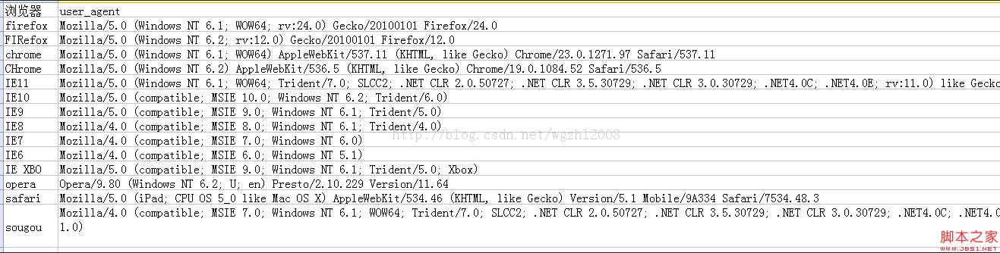

# 浏览器

## BOM

### window

表示浏览器窗口以及页面可见区域，同时它还是ECMAScript中的Global对象，，所有全局变量和函数都是它的属性，且所有原生构造函数及其他函数也都存在于它的命名空间下。

location、navigator、screen、history

### 全局作用域

所有在全局作用域中声明的变量/函数都会变成window对象的属性和方法。

全局变量不能通过delete删除，而直接定义在window对象上的属性可以

```javascript
var age = 12；
window.color = “red”；

delete window.age IE<9出错,其他浏览器返回false
delete window.color E<9出错,其他浏览器返回true
```

访问未声明的变量会抛出错误，通过查询window对象，可以知道某个可能未声明的变量是否存在

```javascript
var newval = oldValue；	//oldValue未定义，出错
var newval = window.oldValue； //undefined
```

### 窗口关系及框架

每个框架都拥有自己的window对象，并且保存在frames集合中，通过索引或框架名称来访问相应的window对象。每个window对象都有一个name属性，其中包含框架的名称。

```javascript
<frameset>
  <frame src name="topFrame">
  <frameset>
  	<frame src name="leftFrame">
    <frame src name="rightFrame">
  </frameset>
</frameset>
```

​	可通过window.frames[0]或window.frames["topFrame"]引用上方框架，最好用top.frames[0]。top始终指向最外层的框架即浏览器窗口。使用它可以确保在一个框架中正确访问另一个框架。而window对象指向的都是那个框架的特定实例，而非最高层的框架。

​	与top相对应的另一个window对象是parent。parent始终指向当前框架的直接上层框架。某些情况下parent有可能等于top，在没有框架的情况下，parent一点等于top（此时它们都等于window)

​	parent指包含当前框架的框架，如果是frame包含则指的就是这个frame，如果是浏览器包含就是指浏览器

### 窗口大小

innerWidth

innerHeight

outerWidth

outerHeight

## 客户端检测

#### 能力检测

先检测最常用特性以保证代码最优化

##### 更可靠的能力检测

检测某个属性是否存在并不能确定对象是否支持排序，因为任何包含sort属性的对象也会返回true   {sort: true};

```javascript
function isSortable(object){
  return  !object.sort";
}
```

更好的方式是检测sort是不是一个函数

```javascript
function isSortable(object){
  return typeof object.sort == "function";
}
```

##### typeof行为不标准

例一：宿主对象没有义务让typeof返回合理的值

​	大多数浏览器检测typeof  document.createElement IE9之后返回function，IE8之前返回"object",DOM是宿主对象，IE8及更早版本中的宿主对象是通过COM而非JSscript实现的。

例二:ActiveX对象（只有IE支持）

```javascript
var xhr = new ActiveXObject("Microsoft.XMLHttp");
if (xhr.open){ //直接把函数作为属性访问会出错
  XXXX
}
```

typeof xhr.open返回“unknown”

解决方案：在浏览器环境下测试任何对象的某个特性是否存在，使用：

```javascript
function isHostMethod(object, property){
  var t = typeof object[property];
  return t == "function" || (!!(t == "object" && object[property])) ||
    	t == "unknown";
}
因为typeof null也是object，所有要检测object[property]是否存在
!!保证返回的boolean类型
```

##### 能力检测不是浏览器检测

​	不能通过检测某个能力存在与否就来确定是哪一个浏览器。在实际开发中应将能力检测作为确定下一步解决方案的一句，而不是用它来判断用户使用的是什么浏览器。

如果应用程序需要使用某些特定的浏览器特性，最好一次性检测所有相关特性，而不是分别检测。

```javascript
var hasDom1 = !!(document.getElementById && document.createElement && document.getElementByTagName);;
```

#### 怪癖检测

​	识别浏览器的特殊行为。通过运行一小段代码，识别浏览器存在什么缺陷，以确定某一特性不能正常工作。

例：IE8之前：如果某个实例属性与某个原型属性名同名，则该实例属性将不会出现在for—in循环当中

Safari3以前会枚举被隐藏的属性

#### 用户代理检测

优先级在能力检测和怪癖检测之后

五大呈现引擎：IE、Gecko、WebKit、KHTML、Opera



```javascript
var client = function() {
  var engint = {
    ie: 0,
    gecko: 0,
    webkit: 0,
    khtml: 0,
    opera: 0,
    
    ver: null
  };
  return {
    engine: engine
  }
}();
```

要正确识别呈现引擎，关键是检测顺序要正确。如果检测顺序不对，很可能导致检测结果不正确。

​	第一步就是识别opera，因为它的用户代理字符串可能完全模仿其他浏览器。我们不相信Opera，是因为任何情况下其用户代理字符串都不会将自己标识为Opera。

```javascript
if (window.opera) {
  engine.ver = window.opera.version();
  engine.opera = parseFloat(engine.ver);
}
```

​	第二位是WebKit，其用户代理字符串包含“Gecko”和“KHTML"，其"AppleWebKit"是独一无二的

```javascript
var ua = navigator.userAgent;

if (window.opera) {
  engine.ver = window.opera.version();
  engine.opera = parseFloat(engine.ver);
} else if (/AppleWebKit\/(\S+)/.test(ua)){	//AppleWebKit/536.5
  engint.ver = RegExp.$1;
  engine.webkit = parseFloat(engine.ver);
}
```

​	第三位是KTHML，KTHML用户代理字符串包含“Gecko”，其版本号与WebKit的版本号在用户代理字符串格式中差不错。Konqueror3.1及更早版本不包含KTHML版本，故而使用Konqueror的版本代替。

```javascript
var ua = navigator.userAgent;

if (window.opera) {
  engine.ver = window.opera.version();
  engine.opera = parseFloat(engine.ver);
} else if (/AppleWebKit\/(\S+)/.test(ua)){
  engint.ver = RegExp.$1;
  engine.webkit = parseFloat(engine.ver);
} else if (/KHTML\/(\S+)/.test(ua) || /Konqueror\/([^;]+)/.test(ua)) {	//(KHTML, like Gecko)
  engine.ver = RegExp.$1;
  engine.khtml = parseFloat(engine.ver);
}
```

​	第四位Gecko，Gecko的版本号不会出现在字符串“Gecko”后面，而是在“rv:"之后

```javascript
var ua = navigator.userAgent;

if (window.opera) {
  engine.ver = window.opera.version();
  engine.opera = parseFloat(engine.ver);
} else if (/AppleWebKit\/(\S+)/.test(ua)){
  engint.ver = RegExp.$1;
  engine.webkit = parseFloat(engine.ver);
} else if (/KHTML\/(\S+)/.test(ua) || /Konqueror\/([^;]+)/.test(ua)) {
  engine.ver = RegExp.$1;
  engine.khtml = parseFloat(engine.ver);
} else if (/rv:([^\)]+)\) Gecko\/\d(8)/.test(ua)) {	//  rv:24.0) Gecko/20100101
  engine.ver = RegExp.$1;
  engine.gecko = parseFloat(engine.ver);
}
```

​	第五位IE，版本号位于“MSIE"的后面，分号之前

```javascript
var ua = navigator.userAgent;

if (window.opera) {
  engine.ver = window.opera.version();
  engine.opera = parseFloat(engine.ver);
} else if (/AppleWebKit\/(\S+)/.test(ua)){
  engint.ver = RegExp.$1;
  engine.webkit = parseFloat(engine.ver);
} else if (/KHTML\/(\S+)/.test(ua) || /Konqueror\/([^;]+)/.test(ua)) {
  engine.ver = RegExp.$1;
  engine.khtml = parseFloat(engine.ver);
} else if (/rv:([^\)]+)\) Gecko\/\d(8)/.test(ua)) {	//  rv:24.0) Gecko/20100101
  engine.ver = RegExp.$1;
  engine.gecko = parseFloat(engine.ver);
} else if (/MSIE ([^;]+)/.test(ua)){	//MSIE 10.0;
  engine.ver = RegExp.$1;
  engine.gecko = parseFloat(engine.ver);
}
```

#### 识别浏览器和平台

```javascript
var client = function() {
  var engint = {
    ie: 0,
    gecko: 0,
    webkit: 0,
    khtml: 0,
    opera: 0,
    
    ver: null
  };
  
  var brower = {
    ie: 0,
    firefox: 0,
    chrome: 0,
    safari: 0,
    opera: 0,
    knoq: 0,
    
    ver: null
  };
  
  var system = {
  	win： false,
    mac: false,
    xll: false
  };
  
  //在此检测呈现引擎/设备
  return {
    engine: engine,
    brower: brower
  };
}();
```

```javascript
var ua = navigator.userAgent;

if (window.opera) {
  engine.ver = brower.ver = window.opera.version();
  engine.opera = brower.opera = parseFloat(engine.ver);
} else if (/AppleWebKit\/(\S+)/.test(ua)){
  engint.ver = RegExp.$1;
  engine.webkit = parseFloat(engine.ver);
  
  if (/Chrome\/(\S+)/.test(ua)) {
    brower.ver = RegExp.$1;
    brower.chrome = parseFloat(brower.ver);
  } else if (/Version\/(\S+)/.test(ua)) {
    brower.ver = RegExp.$1;
    brower.safari = parseFloat(brower.ver);
  }
} else if (/KHTML\/(\S+)/.test(ua) || /Konqueror\/([^;]+)/.test(ua)) {
  engine.ver = brower.ver = RegExp.$1;
  engine.khtml = brower.konq = parseFloat(engine.ver);
} else if (/rv:([^\)]+)\) Gecko\/\d(8)/.test(ua)) {	//  rv:24.0) Gecko/20100101
  engine.ver = RegExp.$1;
  engine.gecko = parseFloat(engine.ver);
  
  if (/Firefox\/(\S+)/.test(ua)){
    brower.ver = RegExp.$1;
    brower.firefox = parseFloat(brower.ver);
  }
} else if (/MSIE ([^;]+)/.test(ua)){	//MSIE 10.0;
  engine.ver = brower.ver = RegExp.$1;
  engine.gecko = brower.ie = parseFloat(engine.ver);
}

var p = navigator.platform;
system.win = p.indexOf("win") == 0;
system.mac = p.indexOf("Mac") == 0;
system.xll = (p.indexOf("Xll") == 0) || (p.indexOf("Linux") == 0);
```

## Dom操作

​	DOM是针对HTML和XML文档的一个API。DOM描绘了一个层次化的节点数，允许开发人员添加、删除、修改页面的某一部分。

​	有12种类型的节点：

### Node类型

​	（1：element，3：text）。

​	IE没有公开Node类型的构造函数，因此Node.Element_NODE无效。确定一个元素是什么节点类型使用someNode.nodeType == 1(或2,3....)。

将nodeList转为数组

```javascript
function convertToArray(nodes) {
  var array = null;
  try {
    array = Array.prototype.slice.call(nodes, 0);//非IE
  } catch (ex) {
    //IE8之前NodeList实现为一个COM对象
    array = new Array();
    //所有浏览器都适用
    for (var i=0; i<nodes.length; i++) {
      array.push(nodes[i]);
    }
  }
  return array;
}
```

#### 节点关系

previousSibling	nextSibling

1.hasChildNodes()

2.ownerDodument 每个节点都有的属性，指向节点所在的文档节点

#### 创建DOM

```javascript
var haskell = document.createElement('p');
haskell.id = 'haskell';
haskell.innerText = 'Haskell';

var d = document.createElement('style');
d.setAttribute('type', 'text/css');
d.innerHTML = 'p { color: red }';
IE中支持，其他不支持
var c = document.createElement('<div id="container">container</div>');
```

#### 更新DOM

##### 修改内容

1.innerHTML：如果写入的字符串是通过网络拿到了，要注意对字符编码来避免XSS攻击。

2.innerText或textContent属性，这样可以自动对字符串进行HTML编码，保证无法设置任何HTML标签：

两者的区别在于读取属性时，`innerText`不返回隐藏元素的文本，而`textContent`返回所有文本。另外注意IE<9不支持`textContent`。

Q：以下测试之后并没有转为编码，而是直接作为普通文本插入到节点里面

```html
p.innerText = '<script>alert("Hi")</script>';
// HTML被自动编码，无法设置一个<script>节点:
// <p id="p-id">&lt;script&gt;alert("Hi")&lt;/script&gt;</p>
```
##### 修改css：

DOM节点的`style`属性对应所有的CSS，可以直接获取或设置。因为CSS允许`font-size`这样的名称，但它并非JavaScript有效的属性名，所以需要在JavaScript中改写为驼峰式命名`fontSize`

```html
p.style.color = '#ff0000';
p.style.fontSize = '20px';
p.style.paddingTop = '2em';
```

#### 插入DOM

appendChild：把一个子节点添加到父节点的最后一个子节点。

​	因为我们插入的`js`节点已经存在于当前的文档树，因此这个节点首先会从原先的位置删除，再插入到新的位置。childnodes的新增节点、父节点以及以前的最后一个子节点的关系指针都会相应得到更新。更新完成后，appendChild返回新增的节点。

insertBefore：parentElement.insertBefore(newElement, referenceElement);

#### 替换DOM

replaceChild：返回被替换的节点

#### 删除DOM

removeChild：返回被移除的节点

删除或替换后的节点虽然不在文档树中了，但其实它还在内存中，可以随时再次被添加到别的位置。

Act：children属性是一个只读属性，并且它在子节点变化时会实时更新。

#### cloneDOM

​	cloneNode(boolean)：true：深复制，连同子节点一块复制；false：只复制节点本身。复制后返回的节点副本属于文档所有，但并没有为它指定父节点。

#### normalize

​	空文本节点删除；相邻文本节点合并

### Document类型

#### 1.文档子节点

​	子节点是：DocumentType(<!DOCTYPE>)、Element、ProcessingInstructor或Comment

​	document对象是HTMLDocument(继承自Document类型)的一个实例，表示整个HTML页面或其他基于XML的文档。

```html
document
	html	
		body
```

documentElement属性指向html元素

body指向body

doctype：指向<!DOCTYPE>

#### 2.文档信息

title：文档信息

网页请求相关：

​	url：页面完整url、domain：页面域名、referer：链接到当前页面的那个页面的rul。所有这些信息保存在请求的HTTP头部。

​	不能将domain设置为url中不包含的域：比如原域名wrox.com，不能替换成baidu.com

#### 3.查找元素

getElementById、getElementsByTagName、getElementsByName

#### 4.特殊集合

这些集合都是HTMLCollection对象

document.anchors：包含文档中所有带name特性的a元素

document.forms：form元素

document.images：img元素

document.links：所有带href特性的a元素

4.文档写入

write原样写入、writeln字符串末尾添加换行符

open、close用于打开和关闭网页的输出流

### Element类型

#### 1.html元素

html 中标签名始终都已全部大写表示，在XML中标签名始终与源代码保持一致

className：关联了新样式、立即展现

id、lang修改对用户是透明不可见

dir（ltr、rtl）：修改会立即展现

title：修改后只会在鼠标移动到这个上面才回展现

#### 2.取得特性

getAttribute/取自定义特性返回null

setAttribute/通过dom设置自定义属性值不管用

removeAttribute

​	HTMLElement有5个属性与相应特性一一对应，可通过dom直接访问：id、class、name、align、title

​	getAttribute("style")返回style中包含的css文本，div.style返回一个对象

​	getAttribute("onclick")返回代码字符串，div.onclick返回一个js函数，如果没有返回null

#### 3.attributes属性

getNamedItem(name)、removeNamedItem(name)、setNamedItem(name)、item(pos)

nodeName特姓名   nodeValue特性值

var id = element.attributes.getNamedItem("id").nodeValue;

var id = element.attributes["id"].nodeValue;

### Text类型

可通过nodeValue或data属性访问text节点中包含的文本。

appendData

deleteData(offset, count)

insertData(offset, text)

replaceData(offset, count, text)

splitText(offset)从offset指定位置将当前文本节点分成两个文本节点，之前是一截，本身+之后是一截

substringData(offset, count)：提取从offset指定位置开始到offset+count为止处的字符串

length

createTextNode

### comment类型

### CDATASection类型

### DocumentType类型

### DocumentFragment

​	是一种轻量级的文档，可以包含和控制节点，但不会像完整的文档那样占用额外资源。可将它作为一个仓库来使用，在里面保存将来可能会添加到文档中的节点。它集成了Node的所有方法，如果将文档中的节点添加到文档片段中，就会从文档树中移除该节点。

document.createDocumentFragment()

### Attr类型

var attr = document.createAttribute("align");

attr.value = "left";

## DOM操作技术

### IE动态操作dom

IE当中不允许访问script/style的子节点

```javascript
var node = "function say(){alert('hello')}";
var script = document.createElement("script");
try {
	script.appendChild(document.createTextNode(node));
} catch (ex){
  script.text = node;//IE支持
}
document.body.appentChild(script);                                                                                        
```

```javascript
var style = document.createElement("style");
style.type = "text/css";
try {
	style.appendChild(document.createTextNode("{body:{background:red}"));
} catch (ex){
  style.styleSheet.cssText = "{body:{background:red}";//IE支持
}
var head = document.getElementsByTagName("head")[0];
head.appentChild(style);       
```

​	注：在重用同一个style元素并再次设置styleSheet.cssText，有可能会导致浏览器崩溃。将styleSheet.cssText设置为空字符串，也可能导致浏览器崩溃。

### NodeList

动态实时更新

NodeList

NamedNodeMap

HTMLCollection

```javascript
var div = document.getElementsByTagName("div");  
```


​	单线程执行模式：在JavaScript中，浏览器的JavaScript执行引擎在执行JavaScript代码时，总是以单线程模式执行，也就是说，任何时候，JavaScript代码都不可能同时有多于1个线程在执行。在JavaScript中，执行多任务实际上都是异步调用

## 文件

```javascript
var
    fileInput = document.getElementById('test-image-file'),
    info = document.getElementById('test-file-info'),
    preview = document.getElementById('test-image-preview');
// 监听change事件:
fileInput.addEventListener('change', function () {
    // 清除背景图片:
    preview.style.backgroundImage = '';
    // 检查文件是否选择:
    if (!fileInput.value) {
        info.innerHTML = '没有选择文件';
        return;
    }
    // 获取File引用:
    var file = fileInput.files[0];
    // 获取File信息:
    info.innerHTML = '文件: ' + file.name + '<br>' +
                     '大小: ' + file.size + '<br>' +
                     '修改: ' + file.lastModifiedDate;
    if (file.type !== 'image/jpeg' && file.type !== 'image/png' && file.type !== 'image/gif') {
        alert('不是有效的图片文件!');
        return;
    }
    // 读取文件:
    var reader = new FileReader();
    reader.onload = function(e) {
        var
            data = e.target.result; // 'data:image/jpeg;base64,/9j/4AAQSk...(base64编码)...'            
        preview.style.backgroundImage = 'url(' + data + ')';
    };
    // 以DataURL的形式读取文件:
  	//发起一个异步操作来读取文件内容。因为是异步操作，所以我们在JavaScript代码中就不知道什么时候操作结束，因此需要先设置一个回调函数
    reader.readAsDataURL(file);
});
```

## AJAX

### 请求方法

```javascript
var request;
if (window.XMLHttpRequest) {
    request = new XMLHttpRequest();
} else {
    request = new ActiveXObject('Microsoft.XMLHTTP');
}
request.onreadystatechange = function () { // 状态发生变化时，函数被回调
    if (request.readyState === 4) { // 成功完成
        // 判断响应结果:
        if (request.status === 200) {
            // 成功，通过responseText拿到响应的文本:
            return success(request.responseText);
        } else {
            // 失败，根据响应码判断失败原因:
            return fail(request.status);
        }
    } else {
        // HTTP请求还在继续...
    }
}

// 发送请求:
request.open('GET', '/api/categories');
request.send();
```

​	XMLHttpRequest对象的open()方法有3个参数，第一个参数指定是GET还是POST，第二个参数指定URL地址，第三个参数指定是否使用异步，默认是true，所以不用写。

​	注意，千万不要把第三个参数指定为false，否则浏览器将停止响应，直到AJAX请求完成。如果这个请求耗时10秒，那么10秒内你会发现浏览器处于“假死”状态。

​	最后调用send()方法才真正发送请求。GET请求不需要参数，POST请求需要把body部分以字符串或者FormData对象传进去。

### 安全机制

参考文档：http://www.liaoxuefeng.com/wiki/001434446689867b27157e896e74d51a89c25cc8b43bdb3000/001434499861493e7c35be5e0864769a2c06afb4754acc6000

​	浏览器的同源策略导致的。默认情况下，JavaScript在发送AJAX请求时，URL的域名必须和当前页面完全一致。

​	完全一致的意思是，域名要相同（www.example.com和example.com不同），协议要相同（http和https不同），端口号要相同（默认是:80端口，它和:8080就不同）。有的浏览器口子松一点，允许端口不同，大多数浏览器都会严格遵守这个限制。

### 请求外域解决方法：

#### Flash插件

一是通过Flash插件发送HTTP请求，这种方式可以绕过浏览器的安全限制，但必须安装Flash，并且跟Flash交互。不过Flash用起来麻烦，而且现在用得也越来越少了。

#### 代理服务器

二是通过在同源域名下架设一个代理服务器来转发，JavaScript负责把请求发送到代理服务器：

```
'/proxy?url=http://www.sina.com.cn'

```

代理服务器再把结果返回，这样就遵守了浏览器的同源策略。这种方式麻烦之处在于需要服务器端额外做开发。

#### JSONP

公式插件就用的这个

第三种方式称为JSONP，它有个限制，只能用GET请求，并且要求返回JavaScript。这种方式跨域实际上是利用了<u>浏览器允许跨域引用JavaScript资源：</u>

```
<html>
<head>
    <script src="http://example.com/abc.js"></script>
    ...
</head>
<body>
...
</body>
</html>

```

JSONP通常以函数调用的形式返回，例如，返回JavaScript内容如下：

```
foo('data');
```

这样一来，我们如果在页面中先准备好`foo()`函数，然后给页面动态加一个``节点，相当于动态读取外域的JavaScript资源，最后就等着接收回调了。

以163的股票查询URL为例，对于URL：[http://api.money.126.net/data/feed/0000001,1399001?callback=refreshPrice](http://api.money.126.net/data/feed/0000001,1399001?callback=refreshPrice)，你将得到如下返回：

```
refreshPrice({"0000001":{"code": "0000001", ... });

```

因此我们需要首先在页面中准备好回调函数：

```
function refreshPrice(data) {
    var p = document.getElementById('test-jsonp');
    p.innerHTML = '当前价格：' +
        data['0000001'].name +': ' + 
        data['0000001'].price + '；' +
        data['1399001'].name + ': ' +
        data['1399001'].price;
}
```

当前价格：

刷新

最后用`getPrice()`函数触发：

```
function getPrice() {
    var
        js = document.createElement('script'),
        head = document.getElementsByTagName('head')[0];
    js.src = 'http://api.money.126.net/data/feed/0000001,1399001?callback=refreshPrice';
    head.appendChild(js);
}

```

就完成了跨域加载数据。

#### CORS

所有操作都是要经过浏览器控制处理

​	本域——浏览器——服务器


如果浏览器支持HTML5，那么就可以一劳永逸地使用新的跨域策略：CORS了。

CORS全称Cross-Origin Resource Sharing，是HTML5规范定义的如何跨域访问资源。

了解CORS前，我们先搞明白概念：

```xml
	Origin表示本域，也就是浏览器当前页面的域。当JavaScript向外域（如sina.com）发起请求后，浏览器收到响应后，首先检查Access-Control-Allow-Origin是否包含本域，如果是，则此次跨域请求成功，如果不是，则请求失败，JavaScript将无法获取到响应的任何数据。
```


​	假设本域是`my.com`，外域是`sina.com`，只要响应头`Access-Control-Allow-Origin`为`http://my.com`，或者是`*`，本次请求就可以成功。

​	跨域能否成功，取决于对方服务器是否愿意给你设置一个正确的`Access-Control-Allow-Origin`，决定权始终在对方手中。

​	Type A：

上面这种跨域请求，称之为“简单请求”。简单请求包括GET、HEAD和POST（POST的Content-Type类型仅限`application/x-www-form-urlencoded`、`multipart/form-data`和`text/plain`），并且不能出现任何自定义头（例如，`X-Custom: 12345`），通常能满足90%的需求。

​	Type B：

无论你是否需要用JavaScript通过CORS跨域请求资源，你都要了解CORS的原理。最新的浏览器全面支持HTML5。在引用外域资源时，除了JavaScript和CSS外，都要验证CORS。例如，当你引用了某个第三方CDN上的字体文件时：

```
/* CSS */
@font-face {
  font-family: 'FontAwesome';
  src: url('http://cdn.com/fonts/fontawesome.ttf') format('truetype');
}
```

如果该CDN服务商未正确设置`Access-Control-Allow-Origin`，那么浏览器无法加载字体资源。

​	Type C：

对于PUT、DELETE以及其他类型如`application/json`的POST请求，在发送AJAX请求之前，浏览器会先发送一个`OPTIONS`请求（称为preflighted请求）到这个URL上，询问目标服务器是否接受：

```
OPTIONS /path/to/resource HTTP/1.1
Host: bar.com
Origin: http://my.com
Access-Control-Request-Method: POST
```

服务器必须响应并明确指出允许的Method：

```
HTTP/1.1 200 OK
Access-Control-Allow-Origin: http://my.com
Access-Control-Allow-Methods: POST, GET, PUT, OPTIONS
Access-Control-Max-Age: 86400
```

浏览器确认服务器响应的`Access-Control-Allow-Methods`头确实包含将要发送的AJAX请求的Method，才会继续发送AJAX，否则，抛出一个错误。

由于以`POST`、`PUT`方式传送JSON格式的数据在REST中很常见，所以要跨域正确处理`POST`和`PUT`请求，服务器端必须正确响应`OPTIONS`请求。

需要深入了解CORS的童鞋请移步[W3C文档](http://www.w3.org/TR/cors/)。

## Promise

参考文档：http://www.liaoxuefeng.com/wiki/001434446689867b27157e896e74d51a89c25cc8b43bdb3000/0014345008539155e93fc16046d4bb7854943814c4f9dc2000

```javascript
Promise两个参数：第一个是成功，第二个是失败
new Promise(function (resolve, reject) {
    log('start new Promise...');
    var timeOut = Math.random() * 2;
    log('set timeout to: ' + timeOut + ' seconds.');
    setTimeout(function () {
        if (timeOut < 1) {
            log('call resolve()...');
            resolve('200 OK');
        }
        else {
            log('call reject()...');
            reject('timeout in ' + timeOut + ' seconds.');
        }
    }, timeOut * 1000);
}).then(function (r) {//成功处理
    log('Done: ' + r);
}).catch(function (reason) {//失败处理
    log('Failed: ' + reason);
});

```
## jQuery

### 自定义插件

编写一个jQuery插件的原则：

1. 给`$.fn`绑定函数，实现插件的代码逻辑；
2. 插件函数最后要`return this;`以支持链式调用；
3. 插件函数要有默认值，绑定在`$.fn..defaults`上；
4. 用户在调用时可传入设定值以便覆盖默认值。

```javascript
$.fn.highlight = function (options) {
    // 合并默认值和用户设定值:
    var opts = $.extend({}, $.fn.highlight.defaults, options);
    this.css('backgroundColor', opts.backgroundColor).css('color', opts.color);
    return this;
}

// 设定默认值:
$.fn.highlight.defaults = {
    color: '#d85030',
    backgroundColor: '#fff8de'
}
```
# 事件

## 事件绑定

方法一：是直接在代码上加载事件

```javascript
<tr onmouseover='this.style.backgroundColor="red"' onmouseout='this.style.backgroundColor=""'><td>text1</td><td>text2</td></tr>
```

方法二：使用DOM的方式获取对象，并加载事件

```javascript
doms = document.getElementsByTagName('tr');
doms[0].onmouseover = function()
    {
        this.style.backgroundColor = "red";
    }
```

方法三：使用标准的addEventListener方式和IE私有的attachEvent方式，因为IE的attachEvent方式在参数传递时的缺陷

```javascript
 	//第一种：所有浏览器支持  
    oBig.onclick = function(){  
        console.log('Big Div');  
    }  
    //第二种：ie8及ie8以下不支持  
    oBig.addEventListener('click', function(){  
        console.log('Big Div');  
    }, true);  
  
    //第三种：ie6~ie10支持  
    oBig.attachEvent('onclick', function(){  
        console.log('Big Div');  
    });  
```

```javascript
element.addEventListener(type, listener[, useCapture]); // IE6~8不支持
```

​	参考文档：http://www.codeceo.com/article/javascript-event-catch-bubble.html

​	useCapture：是否使用捕获，如果值为true， useCapture 表示用户希望发起捕获。 在发起捕获之后， <u>只要Dom子树下发生了该事件类型，都会先被该事件监听器捕获，然后再被派发到Dom子树中的事件监听器中。并且向上冒泡的事件不会触发那些发起捕获的事件监听器。</u>进一步的解释可以查看 DOM Level 3 Events 文档。 useCapture 默认值为false 。


```html
<style>
.container{
  height: 500px;
  width: 500px;
  border: 1px solid red;
}
.inner_txt{
  height: 300px;
  width: 300px;
  border: 1px solid green;
}
.flowctn{
  height: 100px;
  width: 100px;
  border: 1px solid blue;
}
</style>

<div class="container">
  <div class="inner_txt">
    <div class="flowctn">
    </div>
  </div>
</div>

<script>
function fnA(){
  console.log("A");
}
function fnB(){
  console.log("B");
}
function fnC(){
  console.log("C");
}

$(function(){
  var ctn = $(".container")[0];
  var txt = $(".inner_txt")[0];
  var flowctn = $(".flowctn")[0];
  ctn.addEventListener("click", fnA, true);
  txt.addEventListener("click", fnB);
  flowctn.addEventListener("click", fnC);
});
</script>
	自己总结：设置了捕获的监听器优先级最高，由外向内设置了监听器捕获，则先按照由外向内顺序执行设置了捕获的监听器，再由触发节点由内向外执行，不再执行已经设置过捕获的监听器。如以上：
	在flowctn当中点击，因为A设置了事件捕获，所以优先被执行，之后再回到flowctn，再向上冒泡，执行inner_txt，因为container设置了捕获已经被执行，不再被执行。输出ACB
```

`addEventListener`是W3C工作组在DOM Level 2开始引入的一个注册事件监听器的方法；而在此之前，传统的事件监听方法是通过`element[’on’ + type]`的方式来注册的。它们两之间的主要区别是，`element[’on’ + type]`的方式无法使用事件捕获，并且`element[’on’ + type]`不支持对同一个元素的同一个事件注册多个事件监听器。如下面的例子所示，元素被点击后只会输出1，而不会输出0和1.

```
element.onclick = function(){ console.log(0); }
element.onclick = function(){ console.log(1); }
```

然而`addEventListener`方法在IE6~8的浏览器中不被支持。那么在低版本的IE中怎么来为同一个事件注册多个事件监听器呢？原来IE从IE5.0系列开始就引入了`attachEvent()`方法来支持这一特性。但遗憾的是该方法也不支持事件捕获。并且从IE 11开始，这个方法已经被弃用。

### 谈谈事件的捕获和冒泡


W3C规范中定义了3个事件阶段，依次是捕获阶段、目标阶段、冒泡阶段。

​	事件对象按照上图的传播路径依次完成这些阶段。如果某个阶段不支持或事件对象的传播被终止，那么该阶段就会被跳过。举个例子，如果`Event.bubbles`属性被设置为`false`，那么冒泡阶段就会被跳过。如果`Event.stopPropagation()`在事件派发前被调用，那么所有的阶段都会被跳过。

- **捕获** 阶段：在事件对象到达事件目标之前，事件对象必须从window经过目标的祖先节点传播到事件目标。 这个阶段被我们称之为捕获阶段。在这个阶段注册的事件监听器在事件到达其目标前必须先处理事件。
- **目标** 阶段：事件对象到达其事件目标。 这个阶段被我们称为目标阶段。一旦事件对象到达事件目标，该阶段的事件监听器就要对它进行处理。如果一个事件对象类型被标志为不能冒泡。那么对应的事件对象在到达此阶段时就会终止传播。
- **冒泡** 阶段： 事件对象以一个与捕获阶段相反的方向从事件目标传播经过其祖先节点传播到window。这个阶段被称之为冒泡阶段。在此阶段注册的事件监听器会对相应的冒泡事件进行处理。

在一个事件完成了所有阶段的传播路径后，它的`Event.currentTarget`会被设置为`null`并且`Event.eventPhase`会被设为0。`Event`的所有其他属性都不会改变（包括指向事件目标的`Event.target`属性）


