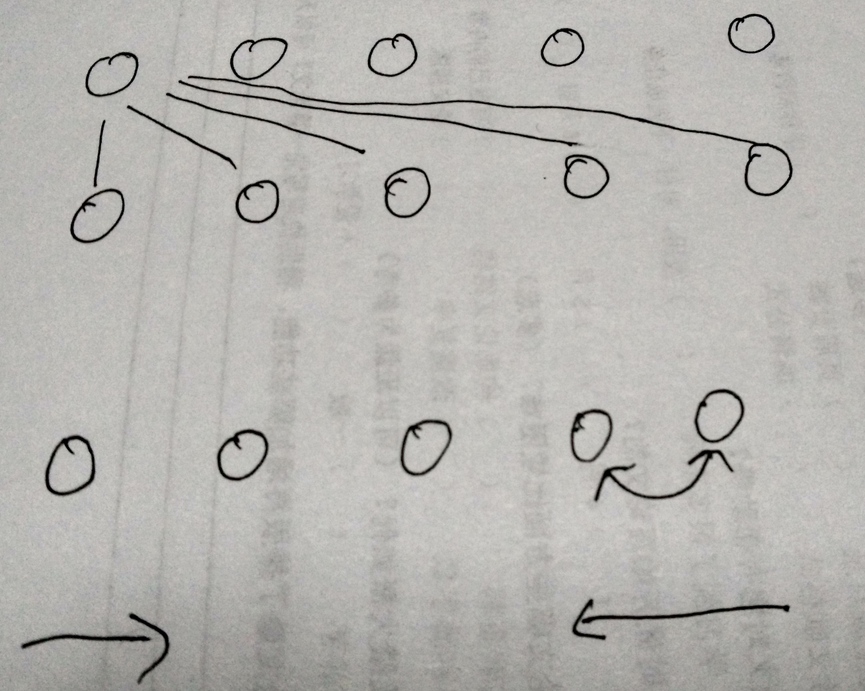

# 排序算法

## 基本算法

```javascript
每一个未排序的与其他的比较，将每一次比较的较小的填充到这个位置上来
function basicSort(data){
  for (var i=0; i<data.length; i++) {
    for (var j=i; j<data.length; j++) {
      if (parseFloat(data[i]) > parseFloat(data[j])) {
        var t = data[i];
        data[i] = data[j];
        data[j] = t;
      }
    }
  }
  return data;
}
```

## 冒泡排序

```javascript
从底部开始，两两比较，将较小的放在前面。就像泡泡一样一直往索引0的位置冒
function bubbleSort(data){
  for (var i=0; i<data.length; i++) {
    for (var j=data.length-1; j>i; j--) {
      if (data[j] > data[j-1]) {
        var t = data[j];
        data[j] = data[j-1];
        data[j-1] = t;
      }
    }
  }
  return data;
}
```



# 递归算法

先将正常的流程写出来，再将特殊条件加进去

```javascript
function extendCopy(p, c) {
  var c = c || {};
  for(var i in p) {
    if (typeOf p[i] === 'object') {
      c[i] = (p[i].constructor == Array) ? [] : {};
      extendCopy(p[i], c[i]);
    } else {
      c[i] = p[i];
    }
  }
  return c;
}
```